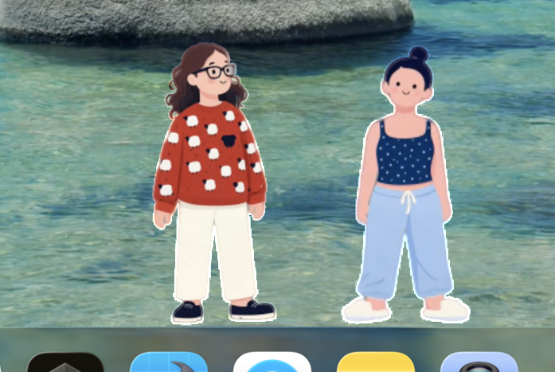

<p align="center">
  
</p>

<h1 align="center">lil agents — merit & muse</h1>
<p align="center">
  tiny ai friends that live on your mac dock.<br/>
  click them. talk to them. get things done.
</p>

<p align="center">
  
  
  
</p>

---

> forked from **[lil agents](https://github.com/ryanstephen/lil-agents)** by Ryan Stephen · upstream app & concept · **[lilagents.xyz](https://lilagents.xyz)**

---

## what it is

two animated characters — **merit** (red) and **muse** (blue-green) — walk around above your Dock. click one to open a floating chat terminal backed by your AI CLI of choice. close it and they go back to their day.

the two-character setup is intentional: **merit** for work, **muse** for personal. same Dock, different headspace.

---

## demo

https://github.com/user-attachments/assets/e728a3d6-649d-4d7a-a8e8-3a60a26c3456

---

## what's different in this fork

### characters
- **merit & muse** — original character designs, names, and copy replacing the upstream defaults
- custom **HEVC + alpha** animation clips: idle loop, walk, popover wave, combined hero, victory one-shot
- Muse plays a small celebration clip on task completion; both characters wave ambientally while idle

### chat & popover
- **multi pop-out windows** — each character can detach multiple independent floating chat sessions simultaneously, each with its own provider override, history, and themed terminal
- thinking bubbles while the AI is working
- full session history preserved when switching themes or reopening

### polish
- completion sounds
- themed terminals (switchable from the menu bar)
- calmer idle animation timing for a less distracting presence on screen

> the pop-out detached chat work has been **contributed back to upstream**.

---

## providers

works with any of these installed on your machine:

| provider | cli |
|---|---|
| Claude | `claude` |
| Codex | `codex` |
| Copilot | `gh copilot` |
| Gemini | `gemini` |
| OpenCode | `opencode` |
| OpenClaw | gateway (advanced settings) |

---

## screenshots

<!-- TODO: add screenshots -->
| dock idle | chat open | pop-out window |
|---|---|---|
| _screenshot_ | _screenshot_ | _screenshot_ |

---

## build

open `lil-agents.xcodeproj` in Xcode and run the **LilAgents** scheme.

for CLI setup, sandbox permissions, and provider install instructions → [upstream readme](https://github.com/ryanstephen/lil-agents/blob/main/README.md).

---

## use your own animations

Clips are **`.mov`** files with **HEVC + alpha** (they should play with transparency in **QuickTime Player**). The app loads them by **basename only** — omit the `.mov` suffix in code (`Bundle.main` adds it).

1. **Export** your idle, walk, wave, combined, and optional victory loops as separate HEVC-with-alpha movies (or one combined clip if you match the timing model upstream uses).
2. **Add them to the LilAgents target** — place the files under the `LilAgents` group in Xcode and ensure **Target Membership → LilAgents** is checked so they appear in **Copy Bundle Resources**.
3. **Wire basenames in code** — edit [`LilAgents/LilAgentsController.swift`](LilAgents/LilAgentsController.swift): `WalkerCharacter(videoName: …)` plus `idleLoopVideoName`, `walkLoopVideoName`, `popoverWaveLoopVideoName`, and optionally `completionOneShotVideoName` / `completionOneShotProbability`.
4. **Retune motion to your edit** — in the same file, adjust `walkHorizontalMoveVideoRange`, `horizontalMoveVideoRange`, `walkPlaybackRate`, `idlePlaybackRate`, etc., so dock movement and footfalls stay aligned with your clip duration and cadence.

If you are starting from **RGBA image sequences**, encode to HEVC-with-alpha with your usual toolchain (e.g. **ffmpeg** + **VideoToolbox** on a Mac); keep a **stable canvas** and **foot anchor** across frames so the character does not drift on the Dock.

---

## sync with upstream

```
origin    → this fork
upstream  → ryanstephen/lil-agents
```

```bash
git fetch upstream
git checkout upstream-main && git merge upstream/main && git push origin upstream-main
git checkout main && git merge upstream-main
```

---

## license

MIT — see [LICENSE](LICENSE).
